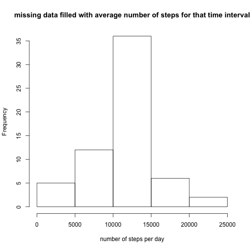

## Loading and preprocessing the data


```r
pdat<-read.csv("activity.csv")
```


## What is mean total number of steps taken per day?

```r
sumstep<-tapply(pdat$steps, factor(pdat$date), function(x) sum(x, na.rm=T))
hist(sumstep,5, xlab="number of steps per day", main="no fill for missing data")
```

 

```r
meanstep<-mean(sumstep)
medstep<-median(sumstep)
```
The mean number of steps per day is 9354.2295 and the median is 10395.
## What is the average daily activity pattern?

```r
mnin<-tapply(pdat$steps, factor(pdat$interval), function (x) mean(x, na.rm=T))
tmint<-levels(factor(pdat$interval))
tmintpad<-sprintf("%04d", as.numeric(tmint))
ptime<-strptime(tmintpad, "%H%M")
plot(ptime, mnin, type="l", xlab="time (5 min intervals)", ylab="average number of steps", main="average daily activity pattern")
```

 

```r
maxsteps=ptime[which.max(mnin)]
printsteps<-strftime(maxsteps,"%H:%M")
```
On average, the maximum number of steps per day are taken at 08:35 

## Imputing missing values

```r
rowswna<-sum(!complete.cases(pdat)) 
missvect<-(which(!complete.cases(pdat)))
pdatmod<-pdat

tind <- rep(NA, rowswna)
for(i in 1:rowswna){
tind[i]<-which(tmint==pdat$interval[missvect[i]])
}
pdatmod$steps[missvect]<-mnin[tind]

sumstepmod<-tapply(pdatmod$steps, factor(pdatmod$date), function(x) sum(x, na.rm=T))
hist(sumstepmod,5, xlab="number of steps per day", main="missing data filled with average number of steps for that time interval")
```

 

```r
meanstepmod<-mean(sumstepmod)
medstepmod<-median(sumstepmod)
options(scipen=5)
```
The number of rows with missing data is 2304. When we replace the missing data with the overall mean for that particular time interval, the mean number of steps per day is 10766.1887 and the median is 10766.1887. These values are larger those calculated with missing data. 
## Are there differences in activity patterns between weekdays and weekends?

```r
n<-("weekday")
m<-("weekend")
pdatmod$day<-as.factor(weekdays(strptime(pdatmod$date, "%Y-%m-%d" )))
dayvect<-ifelse(pdatmod$day %in% c("Saturday", "Sunday"), m, n)
dayvect<-as.factor(dayvect)
pdatmod$day<-dayvect
```


```r
library(lattice) 
```

```
## Warning: package 'lattice' was built under R version 3.0.2
```

```r
wkact<-with(pdatmod, aggregate(steps, list(interval,day), mean))

xyplot(wkact[,3] ~ wkact[,1]|factor(wkact[,2]),layout=c(1,2),
   type="l", xlab="interval", ylab="Average number of steps")
```

 
